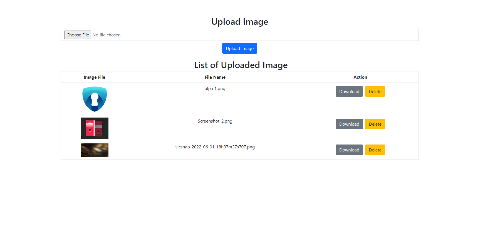

# Node.js Image Upload and Management App

This is a simple Node.js application for uploading, listing, and managing images. The app uses Express for the server, Multer for handling file uploads, and Bootstrap for the frontend.




## Features

- Upload images with a user-friendly interface.
- List and display uploaded images in a table.
- Download and delete images.

## How to Use

### Prerequisites

- Node.js installed
- npm installed

### Installation

1. **Clone the repository:**

   ```bash
   git clone https://github.com/your-username/your-repository.git

2. **Install dependencies:**

   ```bash
   cd your-repository
   npm install

3. **Start the server:**

   ```bash
   npm start
   
3. **Open your browser and go to http://localhost:8080.**

## Usage

- Upload an image using the "Upload Image" form.
- View the list of uploaded images in the table.
- Download or delete images using the corresponding buttons.

## Folder Structure

- **uploads/:** Directory for storing uploaded images.
- **views/:** HTML views for the application.
- **controller/:** Controllers for handling routes and logic.
- **middleware/:** Middleware for route handling.
- **routes/:** Express routes.

## Dependencies

- **Express:** [express](https://www.npmjs.com/package/express)
- **Multer:** [multer](https://www.npmjs.com/package/multer)
- **Bootstrap:** [Bootstrap](https://getbootstrap.com/)

## Contributing

Feel free to contribute by opening issues or submitting pull requests.

## License

This project is licensed under the MIT License - see the [LICENSE](LICENSE) file for details.


   
